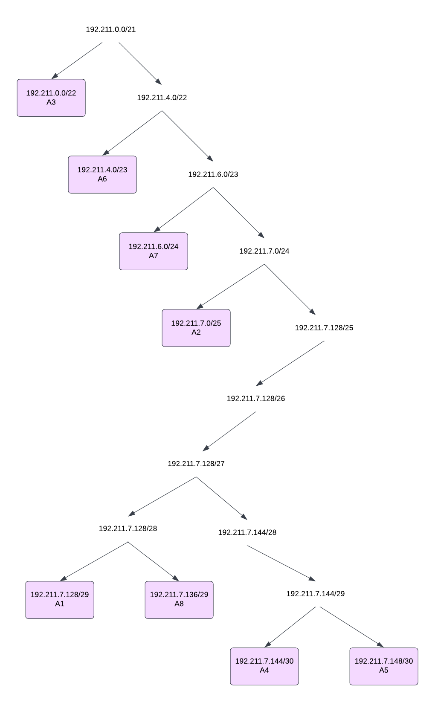

# Jarkom-Modul-5-ITA02-2022

Anggota Kelompok ITA02:
1. Muhammad Faris Anwari (5027201008)
2. Calvindra Laksmono Kumoro (5027201020)
3. Adinda Putri Audyna (5027201073)

Pada pengerjaan awal, kami melakukan pembagian pada setiap area untuk bisa mengetahui netmask yang akan digunakan.


<table>
    <tr>
        <td>Bagian</td>
        <td>Host</td>
        <td>Netmask</td>
        <td> Sorted Netmask</td>
    </tr>
    <tr>
        <td>A1</td>
        <td>3</td>
        <td>/29</td>
        <td>/22</td>
    </tr>
        <tr>
        <td>A2</td>
        <td>63</td>
        <td>/25</td>
        <td>/23</td>
    </tr>
        <tr>
        <td>A3</td>
        <td>701</td>
        <td>/22</td>
        <td>/24</td>
    </tr>
        <tr>
        <td>A4</td>
        <td>2</td>
        <td>/30</td>
        <td>/25</td>
    </tr>
        <tr>
        <td>A5</td>
        <td>2</td>
        <td>/30</td>
        <td>/29</td>
    </tr>
        <tr>
        <td>A6</td>
        <td>256</td>
        <td>/23</td>
        <td>/29</td>
    </tr>
        <tr>
        <td>A7</td>
        <td>201</td>
        <td>/24</td>
        <td>/30</td>
    </tr>
        <tr>
        <td>A8</td>
        <td>3</td>
        <td>/29</td>
        <td>/30</td>
    </tr>
        <tr>
        <td>Total</td>
        <td>1231</td>
        <td>/21</td>
    </tr>
</table>

Setelah dilakukan perhitungan tabel dimana membutuhkan total host sebanyak 1231 dan netmask terbesar yang dibutuhkan ialah /21, maka kita dapat menggunakan netmask /21 untuk memberikan pengalamatan IP pada subnet.

Jadi untuk NID paling atas yaitu 192.211.0.0 dengan netmask /21. Berikut ini gambar pohon sekaligus subnetting untuk pembagian IP:



Penjelasan:

- 192.211.0.0/21 dipecah menjadi 2 cabang yaitu 192.211.0.0/22 dan 192.211.4.0/22 
(jika netmasknya /22 maka address-nya ada 1024, dimana 1024 itu 4 x 256 (256 merupakan max address dalam 1 oktet) sehingga /22 memakan ruang 4 oktet dari 192.211.[x].0 hingga 192.211.[x+3].255 

- 192.211.4.0/22 dipecah menjadi 2 cabang yaitu 192.211.4.0/23 dan 192.211.6.0/23
(jika netmasknya /23 maka addressessnya 512, dimana 512 itu 2 x 256 sehingga /23 memakan ruang 2 oktet dari 192.211.[x].0 hingga 192.211.[x+1].255)


dan seterusnya hingga bagian A18. Dengan mengetahui pembagian IP, kita dapat membuat tabel pembagian Network ID dan Subnet Mask untuk mempermudah implementasi.

<table>
    <tr>
        <td>Bagian</td>
        <td>Netmask (/)</td>
        <td>Netmask</td>
        <td>Netid</td>
    </tr>
    <tr>
        <td>A1</td>
        <td>/29</td>
        <td>255.255.255.248</td>
        <td>192.211.7.128/29</td>
    </tr>
        <tr>
        <td>A2</td>
        <td>/25</td>
        <td>255.255.255.128</td>
        <td>192.211.7.0/25</td>
    </tr>
        <tr>
        <td>A3</td>
       <td>/22</td>
        <td>255.255.252.0</td>
        <td>192.211.0.0/22</td>
    </tr>
        <tr>
        <td>A4</td>
        <td>/30</td>
        <td>255.255.255.252</td>
        <td>192.211.7.144/30</td>
    </tr>
        <tr>
        <td>A5</td>
        <td>/30</td>
        <td>255.255.255.252</td>
        <td>192.211.7.148/30</td>
    </tr>
        <tr>
        <td>A6</td>
        <td>/23</td>
        <td>255.255.254.0</td>
        <td>192.211.4.0/23</td>
    </tr>
        <tr>
        <td>A7</td>
        <td>/24</td>
        <td>255.255.255.0</td>
        <td>192.211.6.0/24</td>
    </tr>
        <tr>
        <td>A8</td>
        <td>/29</td>
        <td>255.255.255.248</td>
        <td>192.211.7.136/29</td>
    </tr>
</table>

Seusai menyusun subnettingnya, kami mengaplikasikan subnetting di konfigurasi topologi. Edit network configuration tiap node, lalu masukkan konfigurasi berikut.

```
[Strix]
auto eth0
iface eth0 inet dhcp

auto eth1
iface eth1 inet static
	address 192.211.7.145
	netmask 255.255.255.252

auto eth2
iface eth2 inet static
	address 192.211.7.149
	netmask 255.255.255.252
```

```
[Westalis]
auto eth0
iface eth0 inet static
	address 192.211.7.146
	netmask 255.255.255.252
    gateway 192.211.7.145

auto eth1
iface eth1 inet static
	address 192.211.7.129
	netmask 255.255.255.248

auto eth2
iface eth2 inet static
	address 192.211.0.1
	netmask 255.255.252.0

auto eth3
iface eth3 inet static
	address 192.211.7.1
	netmask 255.255.255.128

[Eden]
auto eth0
iface eth0 inet static
	address 192.211.7.130
	netmask 255.255.255.248
    gateway 192.211.7.129

[WISE]
auto eth0
iface eth0 inet static
	address 192.211.7.131
	netmask 255.255.255.248
    gateway 192.211.7.129

[Forger]
auto eth0
iface eth0 inet dhcp

[Desmond]
auto eth0
iface eth0 inet dhcp
```

```
[Ostania]
auto eth0
iface eth0 inet static
	address 192.211.4.1
	netmask 255.255.254.0

auto eth1
iface eth1 inet static
	address 192.211.7.150
	netmask 255.255.255.252
    gateway 192.211.7.149

auto eth2
iface eth2 inet static
	address 192.211.7.137
	netmask 255.255.255.248

auto eth3
iface eth3 inet static
	address 192.211.6.1
	netmask 255.255.255.0

[Garden]
auto eth0
iface eth0 inet static
	address 192.211.7.138
	netmask 255.255.255.248
    gateway 192.211.7.137

[SSS]
auto eth0
iface eth0 inet static
	address 192.211.7.139
	netmask 255.255.255.248
    gateway 192.211.7.137

[Blackbell]
auto eth0
iface eth0 inet dhcp

[Briar]
auto eth0
iface eth0 inet dhcp
```

Sesudah melakukan subnetting, selanjutnya kami akan melakukan routing dalam topologi ini agar setiap perangkat pada jaringan tersebut dapat terhubung. Untuk melakukan routing, dibutuhkan NetworkID, netmask, dan gateway.
- Dari topologi yang telah kami buat terlihat bahwa A1, A2, dan A3 terhubung dengan Westalis. Sehingga untuk A1, A2, dan A3 menggunakan Ip gatewaynya Westalis yang mengarah ke Strix (gateway = 192.211.7.146). Selanjutnya juga ditambahkan NID dan netmask untuk masing-masing A1, A2, dan A3.
- Begitu juga untuk A6, A7, dan A8. Dari topologi tersebut dilihat bahwa A6, A7, dan A8 terhubung dengan Ostania. Sehingga untuk A6, A7, dan A8 menggunakan Ip gatewaynya Ostania yang mengarah ke Strix (gateway = 192.211.7.150). Selanjutnya juga ditambahkan NID dan netmask untuk masing-masing  A6, A7, dan A8.

Oleh karena itu kami hanya perlu melakukan settingan routing pada Strix agar semua subnet yang terhubung pada Westalis dan Ostania juga terhubung pada Strix. Berikut routing yang kami gunakan:


```
# A1 A2 A3
route add -net 192.211.7.128 netmask 255.255.255.248 gw 192.211.7.146
route add -net 192.211.7.0 netmask 255.255.255.128 gw 192.211.7.146
route add -net 192.211.0.0 netmask 255.255.252.0 gw 192.211.7.146

# A6 A7 A8
route add -net 192.211.4.0 netmask 255.255.254.0 gw 192.211.7.150
route add -net 192.211.6.0 netmask 255.255.255.0 gw 192.211.7.150
route add -net 192.211.7.136 netmask 255.255.255.248 gw 192.211.7.150
```

Fungsi command di atas ialah menyediakan routing ke tiap subnet yang relevan.

